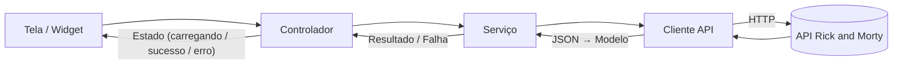

# Desafio Kode, Rick And Morty - Guia do Projeto

> **Este projeto faz parte de um desafio técnico da empresa *Kobe*.**


Rick and Morty – REST client em Flutter. Este documento explica visão geral, requisitos, como rodar localmente (Android, iOS e Web), padrões do projeto e dicas de troubleshooting.

---

## 📦 Visão geral
- **Nome do pacote**: `desafio_rick_and_morty`
- **Descrição**: Cliente REST da API pública [Rick and Morty](https://rickandmortyapi.com/) com Flutter.
- **Gerenciador**: `flutter`/`pub`
- **Estado de publicação**: não publicável ( `publish_to: none` )
- **Suporte a plataformas**: Android, iOS, Web (e Desktop, se habilitado pelo Flutter SDK)

### Principais dependências
- **Flutter** (SDK)
- **Dart**: `>= 3.7.0 < 4.0.0`
- **dio** `^5.7.0` – HTTP client
- **flutter_riverpod** `^2.5.1` – gerenciamento de estado
- **go_router** `^14.2.0` – navegação declarativa
- **cached_network_image** `^3.4.1` – imagens com cache

### Dev dependencies
- **flutter_test** (SDK) – testes de widget/unit
- **flutter_lints** `^4.0.0` – regras de lint

> **Observação:** Não há chaves/segredos. A API Rick and Morty é pública, sem autenticação.

---

## 🛠️ Requisitos do ambiente

> **SDK Dart**: `>= 3.7.0 < 4.0.0` (já incluso quando você instala o Flutter compatível)

### Checagens rápidas
```bash
flutter --version
# verifique se o Dart é >= 3.7

flutter doctor -v
# instale/ajuste o que o doctor acusar
```

---

## ▶️ Rodando o projeto localmente

### 1) Clonar e instalar dependências
```bash
git clone <URL_DO_REPO>
navegue até a o diretorio do projeto ../projects/workshop/desafio_rick_and_morty
cd rnm_app
flutter pub get
```

### 2) Executar (Android/iOS/Web)
- **Android (emulador ou dispositivo):**
  ```bash
  flutter devices           # confirme que o dispositivo aparece
  flutter run -d emulator-5554  # exemplo de ID
  ```
- **iOS (apenas macOS):**
  ```bash
  cd ios && pod install && cd -
  flutter run -d <ID_DO_SIMULADOR>
  ```
- **Web (Chrome):**
  ```bash
  flutter run -d chrome
  ```

> **Dica:** use `flutter run -d <deviceId> -v` para logs detalhados.

### 3) Build de produção (opcional)
- **Android (APK release):**
  ```bash
  flutter build apk --release
  ```
- **Web:**
  ```bash
  flutter build web --release
  # saída em build/web
  ```

---


# Arquitetura & Design

> Documento de referência rápida para entender a organização do código, responsabilidades de cada pasta e como evoluir o projeto com segurança.

## Visão Geral

O projeto segue um **design em camadas por feature (Feature-First)**, organizado por domínio (`characters`, `episodes`, `locations`). Cada feature contém:
- **data**: modelos e serviços (acesso à API / repositórios).
- **presentation**: widgets de UI e controladores/estado.

Componentes **compartilhados** ficam em `core/` (infraestrutura reutilizável), `router/` (navegação) e `widgets/` (UI genérica).

```
lib/
├─ app.dart                 # Raiz do app (Theme, MaterialApp, ProviderScope, etc.)
├─ main.dart                # Bootstrap do app (runApp)
├─ core/                    # Infra, utilitários e tipos base
├─ features/                # Domínios do app (feature-first)
├─ router/                  # Rotas e navegação
└─ widgets/                 # Widgets compartilhados
```

### Objetivo do design
- **Manutenibilidade**: cada domínio é isolado (baixa dependência entre features).
- **Reutilização**: código “agnóstico de domínio” vive em `core/` e `widgets/`.
- **Testabilidade**: serviços desacoplados do UI; controladores expõem estado previsível.
- **Escalabilidade**: adicionar nova feature repete o mesmo padrão (model → service → controller → page).

---

## Pastas e Responsabilidades

### `core/`
- `api_client.dart`: **Gateway HTTP** central. Responsável por:
  - Base URL, cabeçalhos, timeouts, serialização/parse de JSON.
  - Tratar erros e normalizar respostas.
- `paginated_response.dart`: tipo utilitário para **respostas paginadas** (ex.: `info { count, pages, next, prev }` e `results`).
- `providers.dart`: **injeção de dependência/estado** (ex.: `Provider`/`Riverpod`) para disponibilizar `ApiClient`, serviços e controladores ao app.
- `result.dart`: tipo somatório para **fluxo feliz/erro** (ex.: `Success<T>`/`Failure<E>`). Facilita tratamento uniforme de erros.
- `utils.dart`: funções utilitárias (formatação, mapeamentos, helpers de rede, etc.).

**Benefícios**: um único lugar para infraestrutura (trocar client HTTP, logging ou autenticação não rompe as features).

---

### `features/` (Feature-First)
Cada domínio segue um **mini-MVC enxuto**: *Model* (data), *Service* (data source/regras), *Controller* (estado da tela), *Page/Widgets* (UI).

#### `features/characters/`
- `data/character_model.dart`: mapeia o JSON da API → objetos de domínio.
- `data/character_service.dart`: consulta endpoints (lista, detalhes, filtros) e retorna `Result`/`PaginatedResponse`.
- `presentation/characters_controller.dart`: **orquestra a tela** (carregar, paginar, filtrar, tratar erro/loading).
- `presentation/characters_page.dart`: tela de listagem; consome o controller.
- `presentation/character_card.dart`: widget de item.
- `presentation/character_detail_page.dart`: tela de detalhes; carrega um ID e mostra o modelo.

#### `features/episodes/` e `features/locations/`
Mesma lógica e papéis dos arquivos equivalentes acima, cada qual para seu domínio.

**Vantagem**: a equipe navega rapidamente; padrões repetíveis reduzem curva de aprendizado e bugs.

---

### `router/`
- `app_router.dart`: declara rotas nomeadas/typed, argumentos e *guards* (se houver).
- Centraliza navegação **declarativa** (fácil manutenção e *deep links*).

---

### `widgets/` (UI compartilhada)
- `app_bar_custom.dart`: AppBar reutilizável (títulos, ações padrão).
- `error_retry.dart`: estado de erro com ação de “tentar novamente” padronizada.
- `loading.dart`: indicador de carregamento padrão.
  
Esses componentes mantêm **consistência visual** e reduzem duplicação.

---

## Fluxo de Dados (request → UI)



- **Controller** expõe estados imutáveis (ex.: `AsyncValue`, `StateNotifier`, etc.).
- **Service** isola a orquestração de endpoints e regras de negócio simples (paginação, filtros).
- **ApiClient** concentra a comunicação HTTP e tratamento de falhas (timeouts, códigos 4xx/5xx).

---

## 🌐 Endpoints da API (referência rápida)
Base URL: `https://rickandmortyapi.com/api`

- **Characters**
  - `GET /character`
  - `GET /character/{id}` ou `/character/{id1,id2,...}`
- **Episodes**
  - `GET /episode`
  - `GET /episode/{id}` ou `/episode/{id1,id2,...}`
- **Locations**
  - `GET /location`
  - `GET /location/{id}` ou `/location/{id1,id2,...}`

> Os serviços usam paginação da própria API (links `info.next`/`info.prev`).

---


